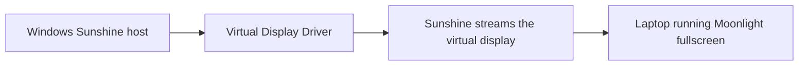

# Sunshine Second Monitor 

[](https://github.com/stef1949/Sunshine-Secondary-Monitor/actions/workflows/powershell-lint.yml)

Use a laptop running Moonlight as a streamed secondary monitor for a Windows Sunshine host.

This project does not create a physical display connection. It automates a Windows virtual-display workflow:



The included PowerShell script saves and restores monitor layouts with Monitor Profile Switcher. Sunshine can run the script before and after a Moonlight session so your host switches into a virtual-display layout for streaming, then returns to your normal monitor layout when the session ends.

## What Is Included

- `scripts/SunshineSecondMonitor.ps1` - host-side monitor profile automation.
- `docs/setup.md` - first-time setup guide.
- `docs/sunshine-configuration.md` - Sunshine app and display ID configuration.
- `docs/troubleshooting.md` - common fixes.
- `docs/moonlight-client.md` - laptop client notes.
- `examples/` - Sunshine command examples and an optional laptop launcher.
- `.github/workflows/powershell-lint.yml` - PowerShell lint workflow.

No third-party executables, drivers, installers, or binary tools are bundled.

## Requirements

- Windows host PC.
- [Sunshine](https://github.com/LizardByte/Sunshine) installed on the host.
- [Moonlight](https://moonlight-stream.org/) installed on the laptop.
- A Windows virtual display driver, such as [Virtual Display Driver](https://github.com/VirtualDrivers/Virtual-Display-Driver), installed separately.
- [Monitor Profile Switcher](https://sourceforge.net/projects/monitorswitcher/) downloaded separately, with `MonitorSwitcher.exe` copied into `C:\SunshineSecondMonitor\`.

Security note: download Sunshine, Moonlight, Monitor Profile Switcher, and the virtual display driver only from their official project pages or release pages. This repository intentionally does not redistribute those tools.

## Runtime Folder Layout

The script defaults to this host-side folder:

```text
C:\SunshineSecondMonitor\
├─ SunshineSecondMonitor.ps1
├─ MonitorSwitcher.exe
├─ profiles\
│  ├─ normal.xml
│  └─ moonlight-second-monitor.xml
└─ sunshine-second-monitor.log
```

You can use another folder with `-BaseDir`, but the Sunshine examples use `C:\SunshineSecondMonitor`.

## First-Time Setup

1. Install Sunshine on the Windows host.
2. Install the virtual display driver on the Windows host.
3. Download Monitor Profile Switcher separately.
4. Create the runtime folder and copy this project script:

   ```powershell
   New-Item -ItemType Directory -Force -Path "C:\SunshineSecondMonitor\profiles"
   Copy-Item ".\scripts\SunshineSecondMonitor.ps1" "C:\SunshineSecondMonitor\SunshineSecondMonitor.ps1"
   ```

5. Copy `MonitorSwitcher.exe` into `C:\SunshineSecondMonitor\`.
6. Arrange your normal physical monitors in Windows Settings, then save the normal layout:

   ```powershell
   powershell.exe -NoProfile -ExecutionPolicy Bypass -File "C:\SunshineSecondMonitor\SunshineSecondMonitor.ps1" -Mode save-normal
   ```

7. Enable the virtual display, extend the desktop to it, set the resolution/scaling you want for the laptop, and arrange it in Windows Settings.
8. Save the streaming layout:

   ```powershell
   powershell.exe -NoProfile -ExecutionPolicy Bypass -File "C:\SunshineSecondMonitor\SunshineSecondMonitor.ps1" -Mode save-stream
   ```

9. Test switching:

   ```powershell
   powershell.exe -NoProfile -ExecutionPolicy Bypass -File "C:\SunshineSecondMonitor\SunshineSecondMonitor.ps1" -Mode start
   powershell.exe -NoProfile -ExecutionPolicy Bypass -File "C:\SunshineSecondMonitor\SunshineSecondMonitor.ps1" -Mode stop
   ```

10. Find the Sunshine display ID:

    ```powershell
    & "$env:ProgramFiles\Sunshine\tools\dxgi-info.exe"
    ```

11. Configure Sunshine to stream the virtual display. Sunshine may accept a display path such as `\\.\DISPLAY29`, or in newer versions a `device_id` GUID if listed by `dxgi-info.exe`.
12. Add a Sunshine app named `Laptop Second Monitor`, add the do/undo commands from `docs/sunshine-configuration.md`, then connect from Moonlight on the laptop.

See [docs/setup.md](docs/setup.md) for a more detailed walkthrough.

## Script Usage

```powershell
.\SunshineSecondMonitor.ps1 -Mode save-normal
.\SunshineSecondMonitor.ps1 -Mode save-stream
.\SunshineSecondMonitor.ps1 -Mode start
.\SunshineSecondMonitor.ps1 -Mode stop
.\SunshineSecondMonitor.ps1 -Mode status
```

Custom base directory:

```powershell
.\SunshineSecondMonitor.ps1 -Mode status -BaseDir "D:\Tools\SunshineSecondMonitor"
```

Modes:

- `save-normal` saves your everyday physical-monitor layout to `profiles\normal.xml`.
- `save-stream` saves the virtual-display layout used for Moonlight to `profiles\moonlight-second-monitor.xml`.
- `start` loads the streaming layout before Sunshine starts streaming.
- `stop` restores the normal layout after the Moonlight session ends.
- `status` prints detected displays, file paths, profile state, and the log path.

## Sunshine Commands

App name:

```text
Laptop Second Monitor
```

Command:

```text
cmd.exe /c start explorer.exe
```

Do command:

```text
powershell.exe -NoProfile -ExecutionPolicy Bypass -File "C:\SunshineSecondMonitor\SunshineSecondMonitor.ps1" -Mode start
```

Undo command:

```text
powershell.exe -NoProfile -ExecutionPolicy Bypass -File "C:\SunshineSecondMonitor\SunshineSecondMonitor.ps1" -Mode stop
```

Full details are in [docs/sunshine-configuration.md](docs/sunshine-configuration.md).

## Normal Usage

After setup, start the `Laptop Second Monitor` app from Moonlight. Sunshine runs the do command, loads the virtual-display layout, and streams that display. When the session closes, Sunshine runs the undo command and restores your normal monitor layout.

You can also run `start`, `stop`, and `status` manually from PowerShell whenever you need to verify or recover the setup.

## Troubleshooting

Start with:

```powershell
powershell.exe -NoProfile -ExecutionPolicy Bypass -File "C:\SunshineSecondMonitor\SunshineSecondMonitor.ps1" -Mode status
```

Then check `C:\SunshineSecondMonitor\sunshine-second-monitor.log`.

Common issues are covered in [docs/troubleshooting.md](docs/troubleshooting.md), including:

- Sunshine streams the wrong monitor.
- Display ID changes after reboot.
- `MonitorSwitcher.exe` is missing.
- The virtual display does not appear.
- The layout does not restore correctly.
- Moonlight shows a black screen.
- Text looks blurry.
- Sunshine cannot run the prep command.
- PowerShell execution policy blocks the script.
- Windows rearranges displays after sleep/wake.

## Known Limitations

- This is a streamed virtual monitor, not a physical display link.
- Display IDs can change after reboot, driver updates, GPU changes, or virtual display driver reinstallations.
- Monitor layout restore depends on Windows display APIs and GPU driver behavior.
- Sunshine prep commands must run in a Windows user session that can modify display settings.
- Sleep/wake and dock/USB-C changes can cause Windows to reorder displays.
- HDR, high refresh rates, and unusual laptop resolutions may require virtual display driver tuning.

## License

MIT. See [LICENSE](LICENSE).
